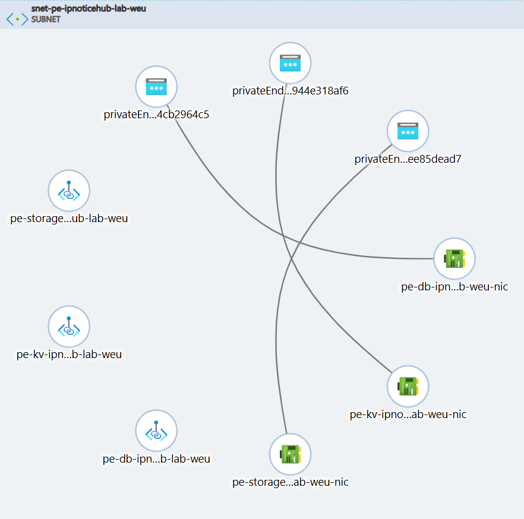
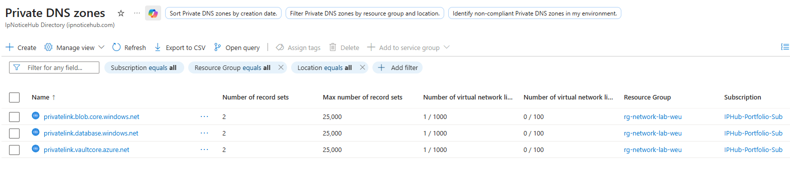
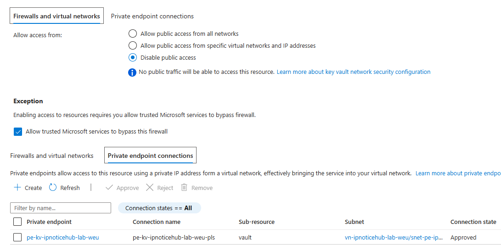
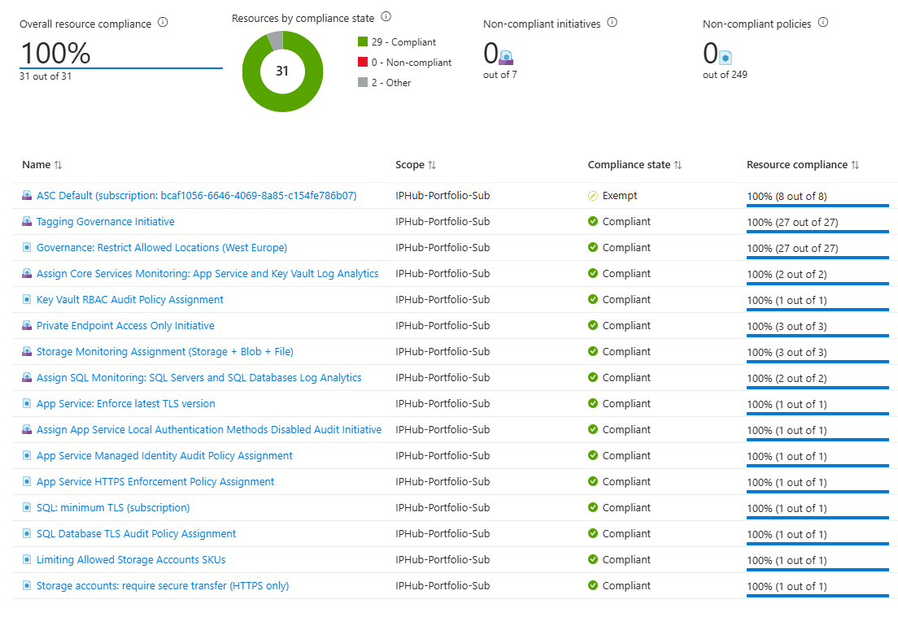
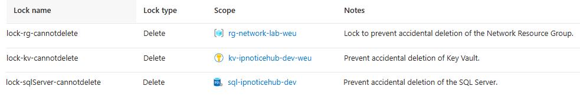
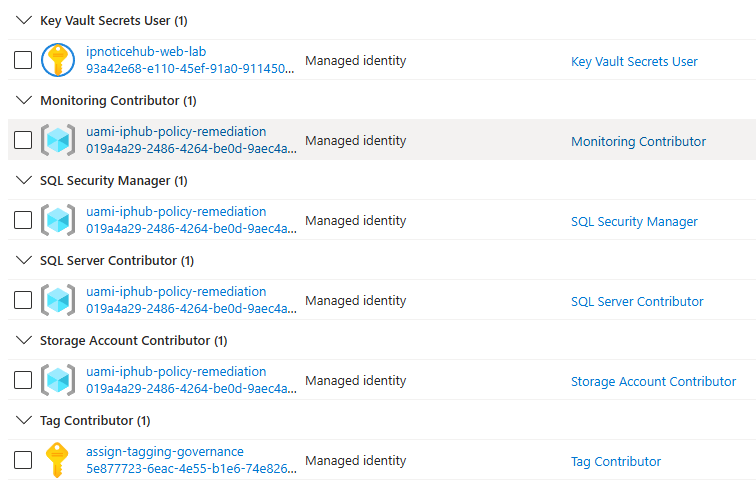

# IPNoticeHub 🛡️
### IP Management & Automated Enforcement

* **IPNoticeHub** is a web application designed to help content creators, online sellers, musicians and brand owners manage their intellectual property registrations and efficiently generate legal documents such as DMCA takedown notices and Cease & Desist letters.

The project is built as a production-oriented portfolio application, combining a cleanly structured .NET backend with a secure, policy-driven Azure infrastructure, and planned deployment via Infrastructure as Code (IaC).

---

### 📩 Getting Started / Demo Accounts

* **Getting Started:**
1. Update the DefaultConnection string in appsettings.json.
2. Update-Database.
3. Run the project.

* **Demo Accounts:**

Admin:
email: admin@ipnoticehub.com |
password: Admin!234

Demo User:
email: demo@ipnoticehub.com |
password: DemoUser!234

* **First Steps Inside the App:**

To use the Trademark Search from the Home page, enter the name of any of the pre-seeded marks such as Google, Apple, LG, Spotify, or others.

For a comprehensive view of the system's capabilities, sign in with the Demo User account. This profile already contains sample trademarks in the user collection and watchlist, as well as sample copyright registrations, allowing the main workflows to be explored immediately.

---

### 🚀 Problem Statement
Online sellers, content creators and brand owners often face unauthorized use of their work across marketplaces, websites, and social platforms.
Enforcement usually requires submitting formal legal documents, which are repetitive to create and difficult to manage over time.

IPNoticeHub addresses these challenges by centralizing registrations, document generation, and monitoring in one system.

---

### 📋 Core Features
* **Global Search** Explore trademark registrations using multiple parameters. 
* **IP Collection** Centralized management for personal Trademarks and Copyrights. 
* **Automated Enforcement** Generation of DMCA takedown notices and Cease & Desist letters. 
* **Document Library** Secure storage and versioning of generated legal documents. 
* **Proactive Monitoring** Watchlist functionality with status change notifications (planned).

---

### 🛠️ Application Architecture
The backend is built on **.NET 10.0** following **Clean Architecture** principles to ensure scalability and maintainability.

* **Core Layers:** Strict separation of Domain, Application, Infrastructure, and Presentation (Web) layers.
* **Data Persistence:** Entity Framework Core with Code-First migrations and explicit entity configurations.
* **Synthetic Data:** Integrated **Bogus** library for generating realistic trademark/user data for UAT and load testing.
* **Document Engine:** Quick PDF generation via **QuestPDF** for legally formatted notices.
* **Quality Assurance:** Automated testing suite using **FluentAssertions** and **SQLite** for isolated, fast execution.

---

### ☁️ Azure Infrastructure & Security (IaC)
The environment is fully provisioned via **Bicep (Infrastructure as Code)**, emphasizing a **Zero-Trust** security model.

### 🔒 Networking & Connectivity
* **VNet Isolation:** Dedicated Virtual Network with dedicated subnets for App Service Integration and Private Endpoints.
* **Private Link Service:** PaaS services (SQL, Key Vault, Storage) have **Public Access Disabled**. Traffic stays within the Azure backbone via **Private Endpoints**.
* **DNS Governance:** Private DNS Zones linked to the VNet for secure, internal name resolution.

### 🛡️ Identity & Cyber Security
* **Keyless Architecture:** Utilizes **User-Assigned Managed Identities** and **Azure RBAC**. No secrets or connection strings are stored in app settings.
* **Secrets Management:** Sensitive configurations are vaulted in **Azure Key Vault** with RBAC-only access.
* **Access Control:** App Service SCM restricted via IP-based Access Restrictions (Home Office IP Allow-listing).

### 📊 Governance & Observability
* **Azure Policy:** Enforced initiatives for HTTPS-only, TLS 1.2+ requirements, and resource location compliance.
* **Operational Excellence:** Log Analytics workspace integration with diagnostic settings enabled for all major services.
* **Cost Management:** Budget alerts and **Resource Delete Locks** applied to critical infrastructure.

---

### 🗺️ Roadmap & Current Status
- ✅ **Phase 1:** Core Application Logic & Clean Architecture.
- ✅ **Phase 2:** Azure Bicep Modules & Infrastructure Provisioning.
- ✅ **Phase 3:** Security Hardening (Private Endpoints & RBAC).
- ⏳ **Phase 4:** CI/CD Pipelines (GitHub Actions/Azure DevOps).
- ⏳ **Phase 5:** Watchlist mailing notifications.

---

### 📸 Infrastructure Preview

🌐 <b>Networking (Click to Expand)</b>

 
The internal network is segmented into dedicated subnets for App Service integration and Private Link endpoints.

 

🗺️ <b>DNS (Click to Expand)</b>

PaaS services are isolated within a private backbone, removing them from the public internet.

 
🔑 <b>KeyVault (Click to Expand)</b>

Hardened Key Vault Networking: Public access is explicitly disabled, with communication restricted solely to private endpoint connections.

 
⚖️ <b>Compliance (Click to Expand)</b>

Policy Compliance The environment is audited against custom Initiatives, ensuring 100% compliance for TLS settings, HTTPS enforcement, and location tagging.

 
🔐 <b>Locks (Click to Expand)</b>

Resource & Resource Group Locks Implementation of CanNotDelete locks on critical infrastructure to protect the Network, SQL, and Key Vault from accidental deletion.

 
🆔 <b>Identity (Click to Expand)</b>

Managed Identity & Role Assignments Utilizing User-Assigned Managed Identities (UAMI) for specific tasks such as tagging governance and policy remediation.

---

### 👨‍💻 Author
* **Nikolay Todorov**
