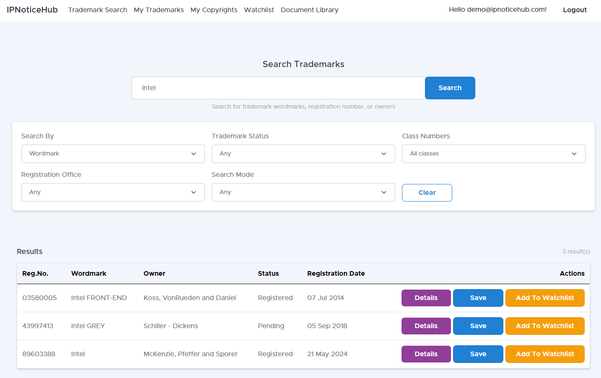
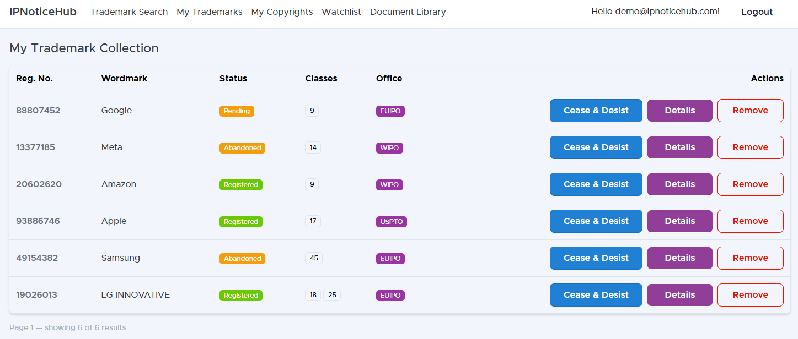
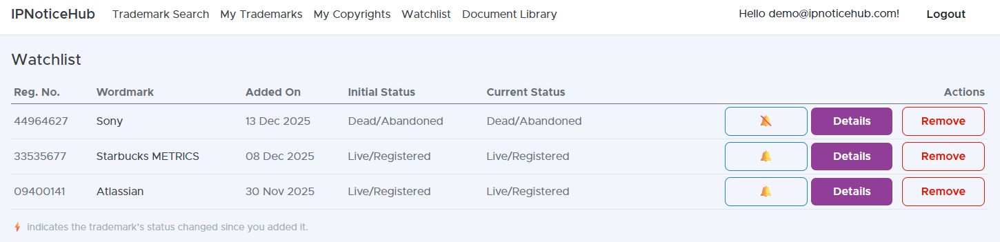

# IPNoticeHub

ASP.NET Core application for intellectual property management and automated legal document generation, deployed to Azure App Service with Terraform infrastructure and GitHub Actions CI/CD across dev and prod environments. Authentication to Azure uses OIDC federated credentials — no secrets stored anywhere.

---

## What It Does

IPNoticeHub helps content creators, online sellers, and brand owners manage intellectual property registrations and generate legal documents like DMCA takedown notices and Cease & Desist letters. Built as a production-oriented portfolio application combining a cleanly structured .NET backend with secure, automated Azure infrastructure.

**Core features:** global trademark search, centralized IP collection management, automated DMCA/C&D document generation via QuestPDF, and a document library with versioning.

---

## Application Preview





---

## What It Deploys

Two identical environments (`dev` and `prod`), each with:

- **App Service** (Linux P1v2) with staging slot for zero-downtime swaps
- **Azure SQL** Server and database
- **Key Vault** (RBAC mode) for credentials and connection strings
- **Application Insights** with Log Analytics for monitoring and diagnostics

Dev environment includes seeded test data via Bogus library. Prod is deployed clean for production use.

---

## Repository Structure

```
├── .github/
│   ├── actions/
│   │   └── terraform-setup/         
│   └── workflows/
│       ├── infrastructure.yml       
│       └── application.yml          
├── src/
│   ├── IPNoticeHub.Web/             
│   ├── IPNoticeHub.Infrastructure/  
│   └── IPNoticeHub.Application/     
├── tests/                           
├── ops/
│   └── infra/
│       ├── main/                    
│       └── env/                     
├── scripts/                         
└── .checkov.yaml                    
```

---

## Infrastructure Pipeline

```
Validate (Terraform validate + TFLint + Checkov) → Plan → Apply
```

A composite action handles Azure OIDC login, Terraform setup, and backend initialization — keeping each job concise. Backend configuration values are computed once in the validate job and passed to subsequent jobs via outputs.

---

## Application Pipeline

```
Build + test + coverage → Deploy to staging → EF migrations → Smoke test → Swap to production
```

The connection string is retrieved from Key Vault at deploy time, masked in logs, and injected as an environment variable for EF Core migrations. Deployments use the staging slot pattern: deploy to staging, verify health, then swap to production with zero downtime. If the smoke test fails, production stays on the previous version.

---

## Application Architecture

Built on **.NET 10** following **Clean Architecture** with strict separation of Domain, Application, Infrastructure, and Web layers.

- **Entity Framework Core** with Code-First migrations and explicit entity configurations
- **QuestPDF** for generating legally formatted DMCA and C&D documents
- **Bogus** library for realistic test data generation (dev environment only)
- **FluentAssertions** and **SQLite** for isolated, fast test execution
- **Coverlet** for code coverage collection

---

## Key Patterns

- **OIDC federated credentials** — no client secrets, short-lived tokens per workflow run
- **Composite action** — shared Terraform setup logic across infrastructure and application workflows
- **Key Vault secret injection** — connection string retrieved at deploy time, masked in logs
- **EF Core migrations in pipeline** — database schema updates run before slot swap
- **Zero-downtime deployment** — staging slot smoke test, then swap to production
- **Concurrency control** — prevents simultaneous pipeline runs against the same environment
- **Checkov + TFLint** — IaC security scanning, Terraform linting

---

## Demo Accounts (Dev Environment)

**Demo Admin:** admin@ipnoticehub.com / Admin!234

**Demo User:** demo@ipnoticehub.com / DemoUser!234

To explore the system, sign in with the Demo User account — it includes sample trademarks, copyright registrations, and generated documents. Use the trademark search on the home page with pre-seeded marks like Google, Apple, LG, or Spotify.

---

## Tools

Terraform, GitHub Actions, ASP.NET Core (.NET 10), Azure App Service, Azure SQL, Azure Key Vault, Application Insights, Entity Framework Core, QuestPDF, Bogus, Checkov, TFLint, Coverlet
